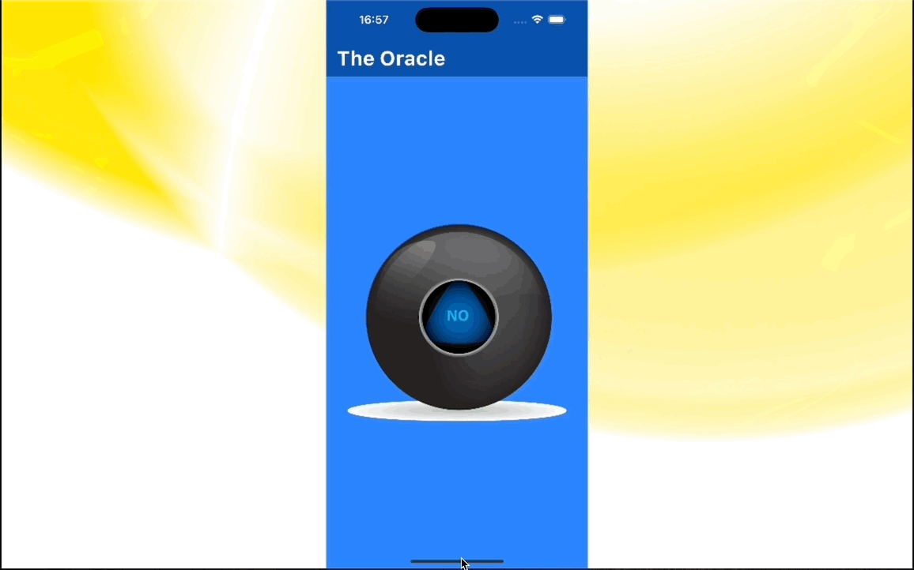

# Magic 8 ball

Simple Magic 8 ball App, developed as a part of App brewery course

This is the first independent challenge

### Features

- programmatically read list of file from assets
- show loading page while async function reads assets file and , filter out one of interest 
i.e. files stored in `assets/magic_ball` directory 
- Show splash animation onTap ( using InkWell for that)
- make sure image fits the height in both orientation

### Todo:

- write tests
- refactor for more efficient code

### Demo

